# Snowflake Labs: Notebooks

This repository covers how to get started with [Snowflake Notebooks](https://docs.snowflake.com/en/user-guide/ui-snowsight/notebooks) from 0 to a working set of notebooks, ready to deploy to your Snowflake account today!

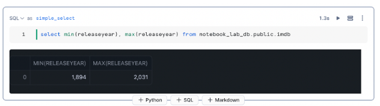

## Setup

We'll need to create a few resources to get ready for our Notebook and have some data to interact with. The next few steps will walk you through how to do that.

### Role, Database, and Warehouse Creation

To get started, go ahead and create a new Worksheet in the Snowflake UI. We'll be creating a [Role](https://docs.snowflake.com/user-guide/security-access-control-overview?utm_cta=website-be-guides-mmds#roles), [Database](https://docs.snowflake.com/en/sql-reference/sql/create-database), and [Warehouse](https://docs.snowflake.com/en/sql-reference/sql/create-warehouse). We'll then grant our role the ability to use the database/warehouse, then grant that role to our user account. This gives us the access we need to do the next steps. This guide assumes that you have access to the `sysadmin` and `securityadmin` roles- if not, you can use roles within your account with similar permissions or reach out to your account administrator for assistance.

Copy the content of the [setup script](scripts/01_setup.sql), paste it into your notebook, and review the commands/comments. Before executing the script, change the text `YOUR_USER_HERE` to be your snowflake username.

Once you're satisfied with the commands in your worksheet, select the text and click the "Run" button. When the commands execute successfully you should be able to validate your newly created objects by running:

```SQL
use role notebook_lab_role;

desc database notebook_lab_db;
```

You should see some basic information about the database we just created. Additionally, it should now appear in the object explorer pane on the left of the snowflake console

**Note:** If you're using a personal account or are otherwise cost-constrained, it's probably a good idea to set up a [Resource Monitor](https://docs.snowflake.com/en/sql-reference/sql/create-resource-monitor) before moving on. We've provided an example script [here](scripts/02_resource_monitor.sql). This _does_ require `accountadmin` permissions- so you may have to reach out to your account admin to get it set up (if they don't have one already).

### Load Data to a new table

Navigate to 'Data' in the lefthand menu and select 'Add Data'. For this Lab we will be using the 'Load data into a Table' functionality to load data directly from a file into a table:

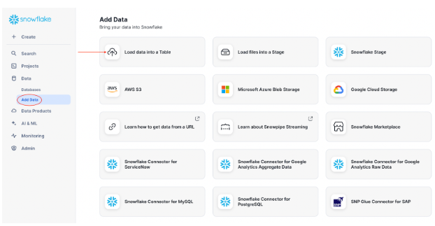

Select your warehouse in the upper right corner of the pop up and use the 'Browse' button to select your data file:

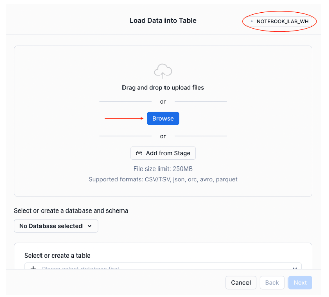

Select your target database and schema, choose 'Create new table' and give your new table a name. Click Next:

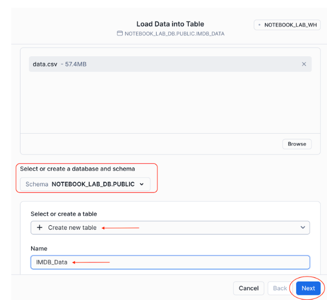

The next window will allow you to update data types, column names and decide what should happen if an error occurs. For this lab, leave the default setting on the left two options and update the 'DATA TYPE' for column 'averageRating' to FLOAT. Click 'Load':

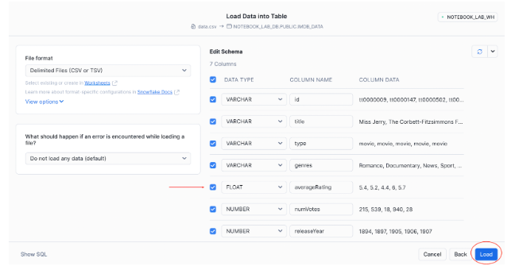

Once your data has successfully loaded, simply click 'Done'!


### Create Notebook

To create a new notebook, Navigate to the "Projects" section on the left pane and select the "Notebooks" tab. Click on the "+ Notebook" button in the top right:

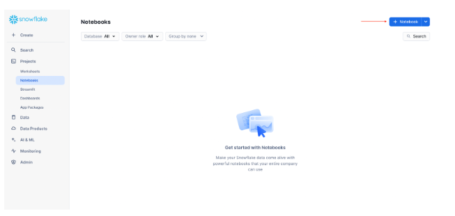

In the resulting dialog, give the notebook a name (like `Snowflake Lab`), a location (in our `NOTEBOOK_LAB_DB` database) and select the `NOTEBOOK_LAB_WH` as the warehouse. For the Python environment option, leave it on `Run on warehouse`, then click "Create":

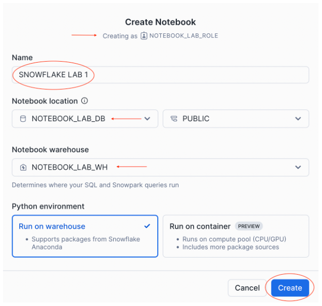

To make sure the notebook works, copy the following code into the first cell:

```SQL
select min(releaseyear), max(releaseyear) from notebook_lab_db.public.imdb
```

You should see a response like:


We've successfully created a Snowflake Notebook!

### Install Anaconda packages

While having a notebook is a great step forwards for being able to explore and share data, one of the main advantages of notebooks is the ability to rapidly develop visualizations using pyton's robust package ecosystem. Snowflake provides a couple ways to install more packages into our snowflake notebook, for this example we'll use [Anaconda](https://www.anaconda.com/download) to install the packages we need.

To do so, simply navigate to your notebook inside of the Snowflake UI, and click on the ‘Packages’ tab on the top right of the page near the ‘Start’ button.

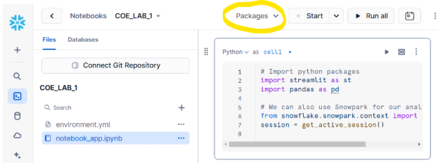

Users can then search for packages available through Anaconda and install them directly from this interface. After selecting the package, it may take several minutes for the package to be installed and ready for use inside of your notebook.

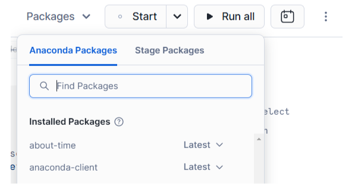

The second method for installing packages is through a Snowflake stage. This method should only be used for packages that are unavailable through Anaconda.

Users must first upload the package to a Snowflake stage, and then install the package in a similar manner as we did for Anaconda.

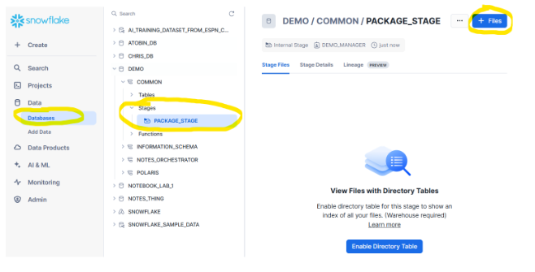

**Note:** Installing packages this way only works for Python packages
**Note:** Wheel and tar.gz files are not currently supported.

### Create a Bar Graph

Next, let's create a visualization of a query. See also: [Snowflake Docs](https://docs.snowflake.com/en/user-guide/ui-snowsight/notebooks-visualize-data)

For this example, we'll be using [Seaborn](https://docs.snowflake.com/en/user-guide/ui-snowsight/notebooks-visualize-data#label-notebooks-visualize-cells-seaborn).

Follow the steps in the above section to install `seaborn` via Anaconda.

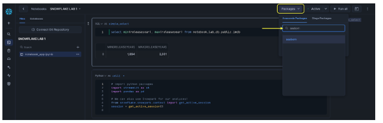

Once installed, the library can be imported and used within a cell- the below notebook cell imports the seaborn package to create a graph grouping movie release year by decade. The full script can be copied from [here](scripts/03_bar_chart_notebook.py):

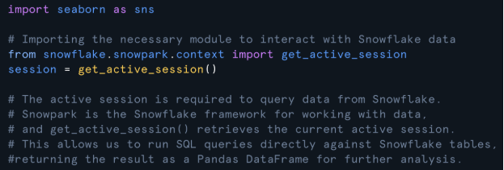

This brings the `seaborn` library into the notebook runtime and sets up a snowpark session that we can use to interact with snowflake objects. Next, we can query to group the movie data we uploaded earlier into decades:

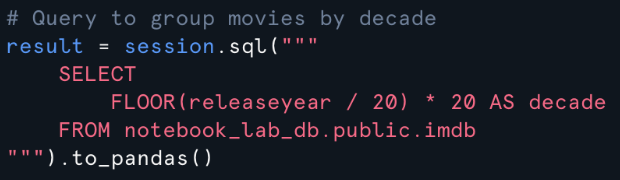

Next, we'll use seaborn to create our graph with the `countplot()` method (see docs [here](https://seaborn.pydata.org/generated/seaborn.countplot.html))

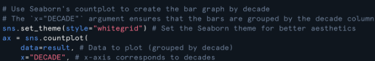

With our chart initialized, we can now begin modifying other attributes to clean it up a bit. Let's configure the title and labels:

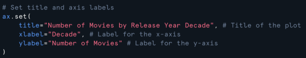

Then, we can add some polish by removing decimals from our labels (decades are integers, after all!):

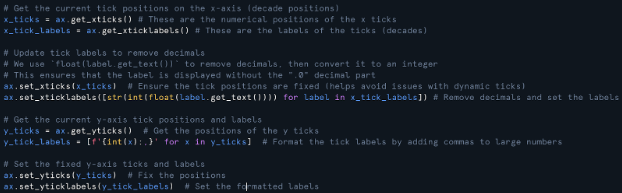

Finally, we can run the cell and see our chart!

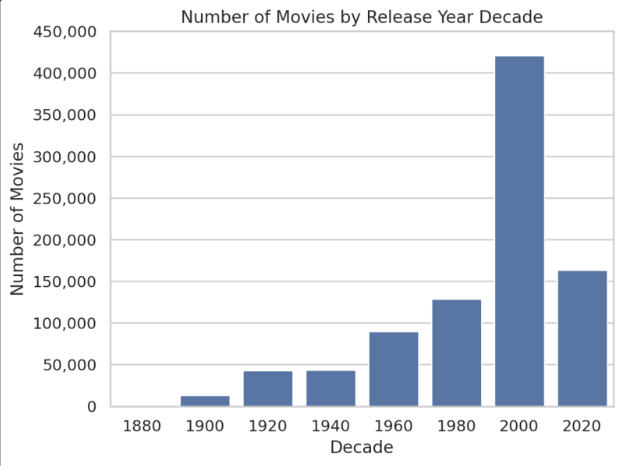
